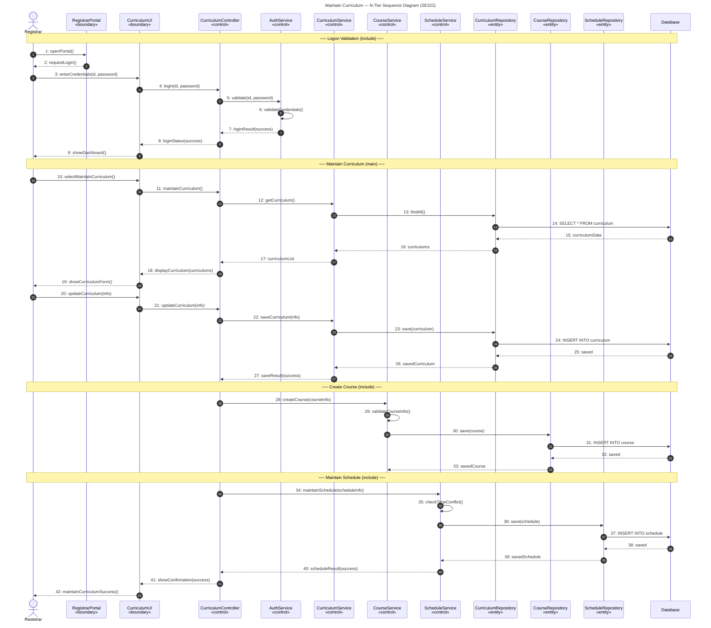

# Maintain Curriculum — Sequence Diagram (Mermaid)

> **Use Case:** Maintain Curriculum (main)  
> **Includes:** Logon Validation, Create Course, Maintain Schedule  
> **Architecture:** N-Tier (Presentation → Application → Data)

## Reading guide
- Solid arrows `->>` are method **calls**.
- Dashed arrows `-->>` are **return** values.
- Self-arrows (`AS->>AS`, `CRS->>CRS`, `SS->>SS`) represent internal
  validation/conflict-check logic that doesn't cross a tier boundary.
- The four `Note over` rows mark the **Logon Validation** (include),
  **Maintain Curriculum** (main), **Create Course** (include), and
  **Maintain Schedule** (include) phases.
- Tier order across the top: **Presentation → Application → Data**.