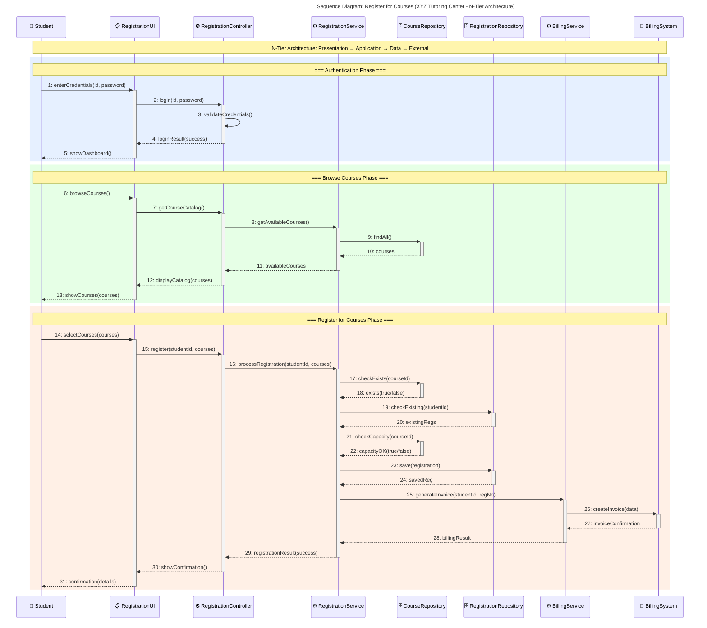

```mermaid
sequenceDiagram
    title Sequence Diagram: Register for Courses (XYZ Tutoring Center - N-Tier Architecture)

    participant Student as 🧑 Student
    participant RegistrationUI as 📋 RegistrationUI
    participant Controller as ⚙️ RegistrationController
    participant Service as ⚙️ RegistrationService
    participant CourseRepo as 🗄️ CourseRepository
    participant RegRepo as 🗄️ RegistrationRepository
    participant Billing as ⚙️ BillingService
    participant BillingSys as 🏢 BillingSystem

    Note over Student,BillingSys: N-Tier Architecture: Presentation → Application → Data → External

    rect rgb(230, 240, 255)
        Note over Student,BillingSys: === Authentication Phase ===
        Student->>+RegistrationUI: 1: enterCredentials(id, password)
        RegistrationUI->>+Controller: 2: login(id, password)
        Controller->>Controller: 3: validateCredentials()
        Controller-->>-RegistrationUI: 4: loginResult(success)
        RegistrationUI-->>-Student: 5: showDashboard()
    end

    rect rgb(230, 255, 230)
        Note over Student,BillingSys: === Browse Courses Phase ===
        Student->>+RegistrationUI: 6: browseCourses()
        RegistrationUI->>+Controller: 7: getCourseCatalog()
        Controller->>+Service: 8: getAvailableCourses()
        Service->>+CourseRepo: 9: findAll()
        CourseRepo-->>-Service: 10: courses
        Service-->>-Controller: 11: availableCourses
        Controller-->>-RegistrationUI: 12: displayCatalog(courses)
        RegistrationUI-->>-Student: 13: showCourses(courses)
    end

    rect rgb(255, 240, 230)
        Note over Student,BillingSys: === Register for Courses Phase ===
        Student->>+RegistrationUI: 14: selectCourses(courses)
        RegistrationUI->>+Controller: 15: register(studentId, courses)
        Controller->>+Service: 16: processRegistration(studentId, courses)
        Service->>+CourseRepo: 17: checkExists(courseId)
        CourseRepo-->>-Service: 18: exists(true/false)
        Service->>+RegRepo: 19: checkExisting(studentId)
        RegRepo-->>-Service: 20: existingRegs
        Service->>+CourseRepo: 21: checkCapacity(courseId)
        CourseRepo-->>-Service: 22: capacityOK(true/false)
        Service->>+RegRepo: 23: save(registration)
        RegRepo-->>-Service: 24: savedReg
        Service->>+Billing: 25: generateInvoice(studentId, regNo)
        Billing->>+BillingSys: 26: createInvoice(data)
        BillingSys-->>-Billing: 27: invoiceConfirmation
        Billing-->>-Service: 28: billingResult
        Service-->>-Controller: 29: registrationResult(success)
        Controller-->>-RegistrationUI: 30: showConfirmation()
        RegistrationUI-->>-Student: 31: confirmation(details)
    end
```
